# Magnus Operational Management System

Our internship project - A barangay appointment management system, requestor informantion system and employee management system.

## Contributors

Feel free to reach us out! All thanks to ResponsivCode Technology Solutions

- [Junrey Lañas](https://www.facebook.com/profile.php?id=100010980994040) (Developer)
- [Drexell Mingo](https://www.facebook.com/Drexell.John27) (Developer)
- [Jonric Manisan](https://www.facebook.com/riczy.08) (UI/UX Designer)
- [Edric Pulgarinas](https://www.facebook.com/edric.pulgarinas.9) (UI/UX Designer)

# Modules

- Employee Module
- User Management
- General Settings
- Authentication
- Forgot/Reset Password
- Admin Creation (User access control)
- Add requestor, events and appointments
- And many more

# Screenshots

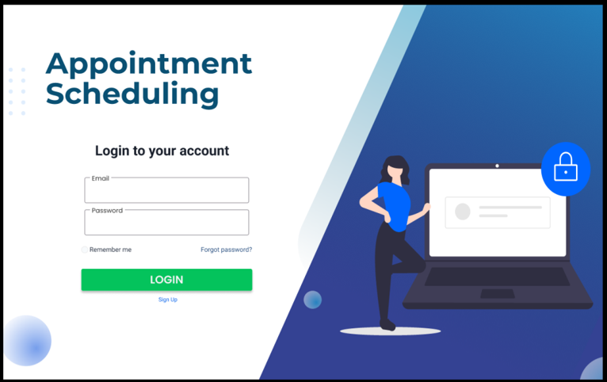

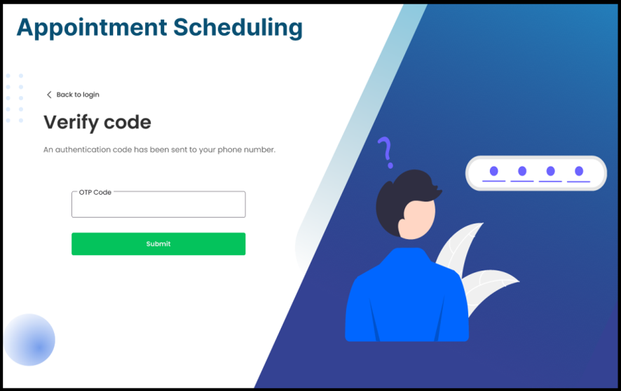
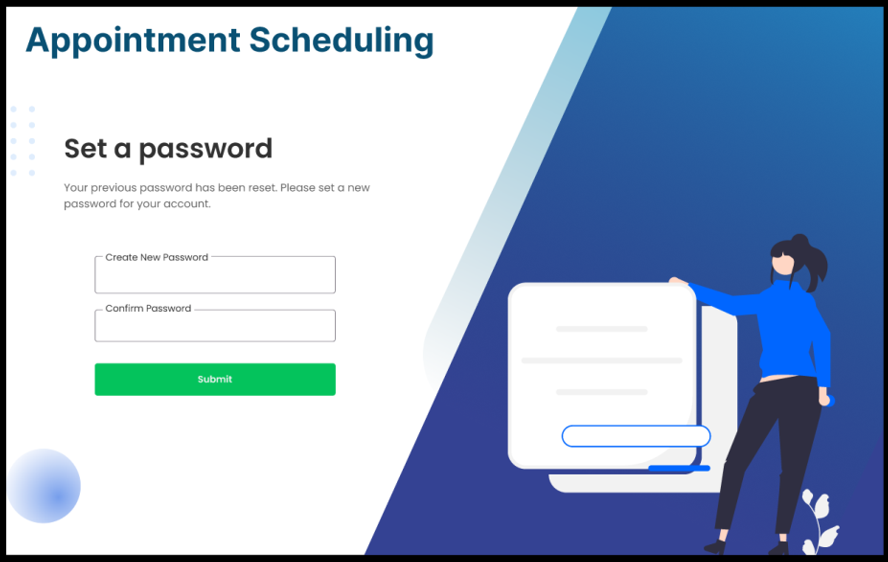
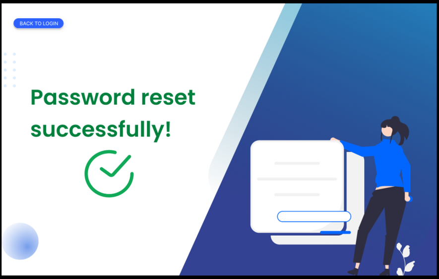

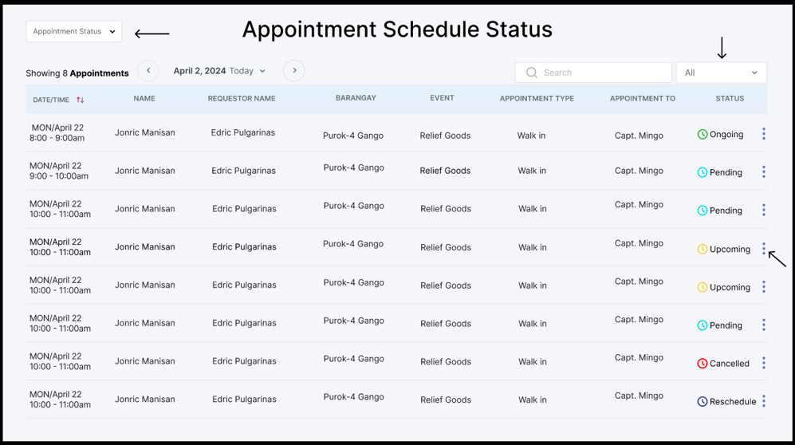
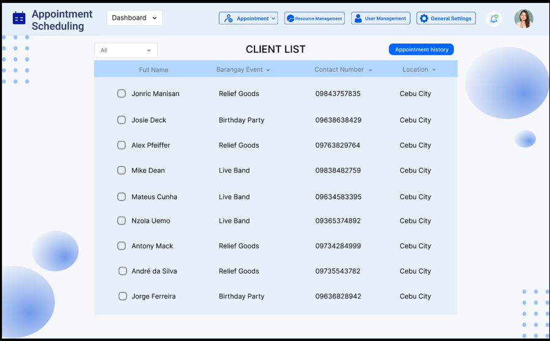
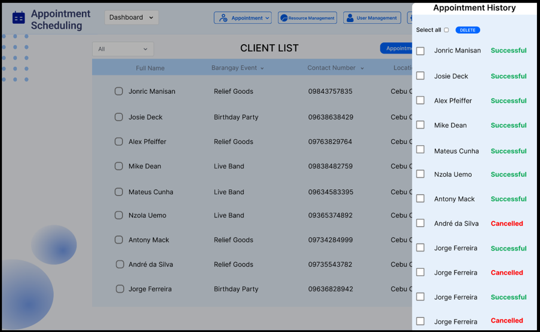
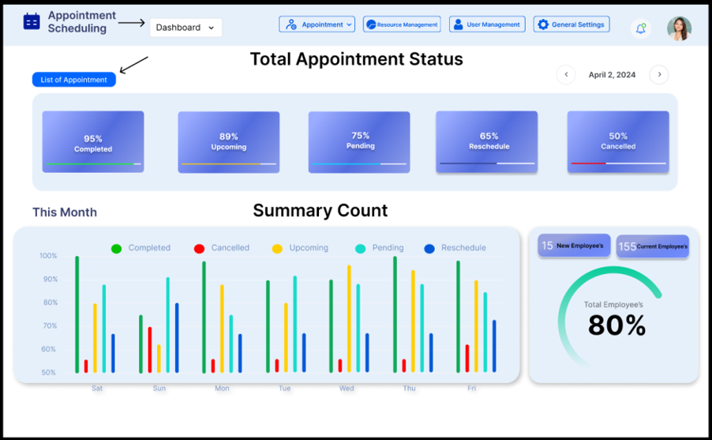
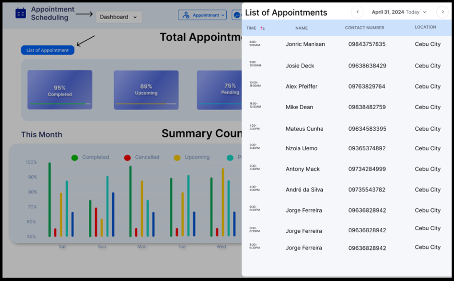

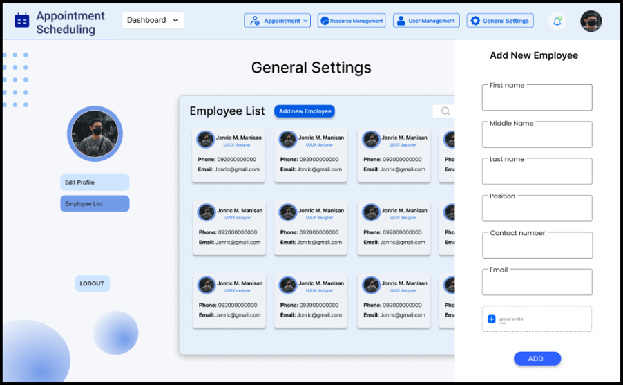
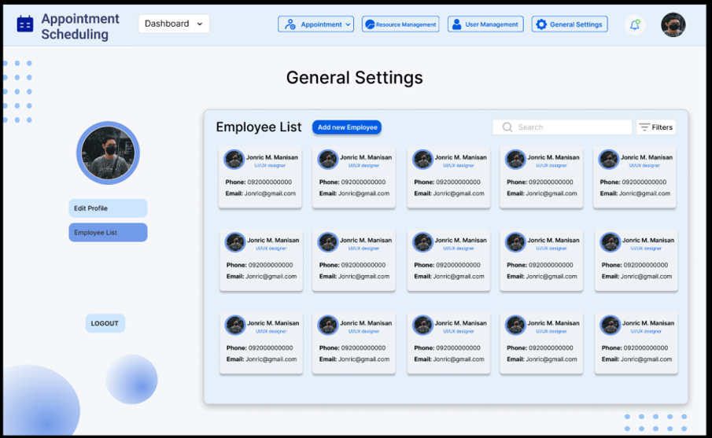

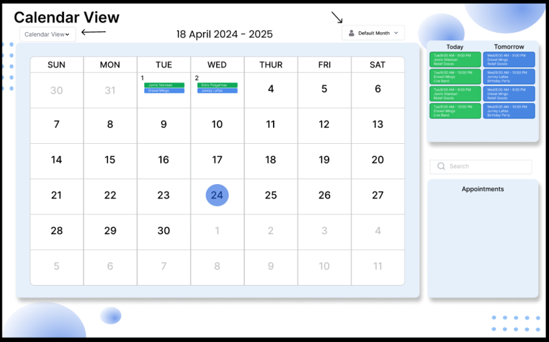
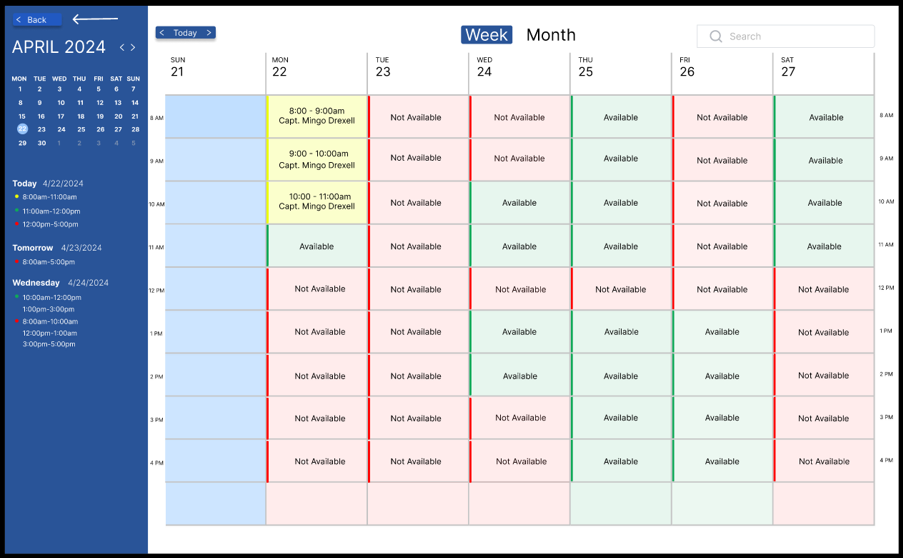

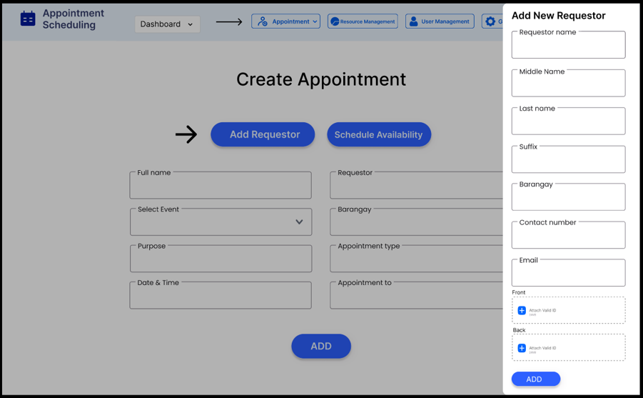
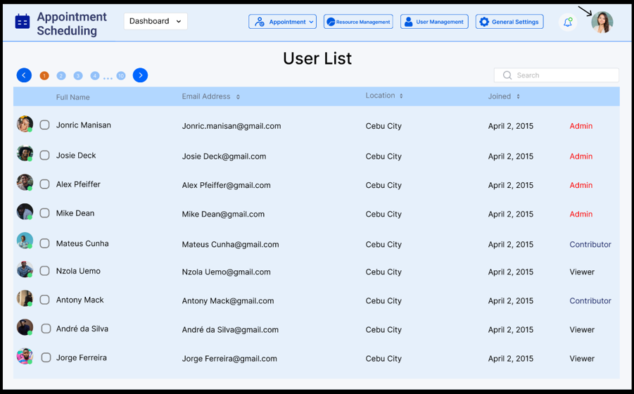

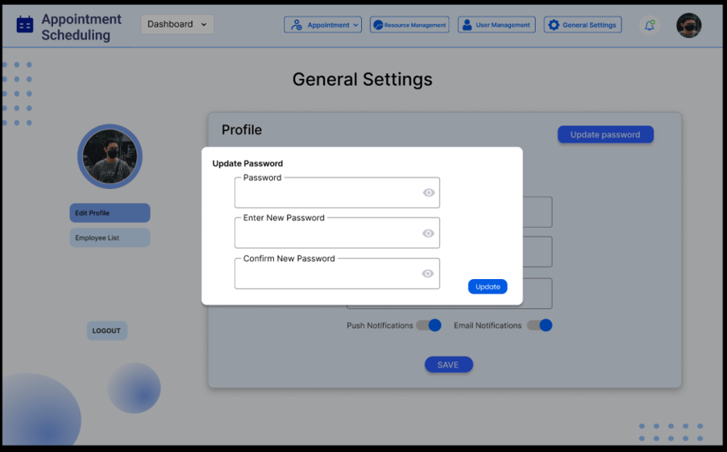
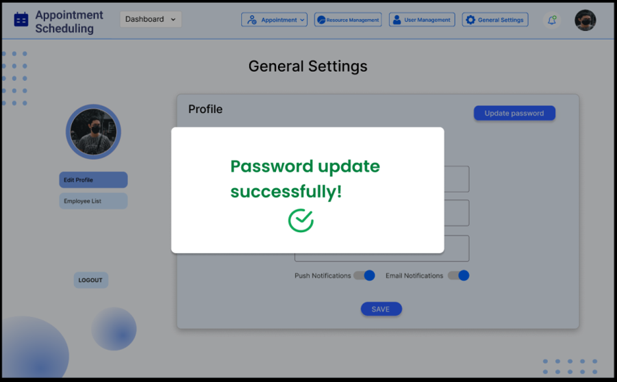

### Happy Coding! ^^
