# Brgy Operational Management System

Our internship project - a barangay appointment management, requestor information, and employee management system.

## Contributors

Feel free to reach us out! All thanks to ResponsivCode Technology Solutions.

- [Junrey Lañas](https://www.facebook.com/profile.php?id=100010980994040) (Lead Developer)
- [Drexell Mingo](https://www.facebook.com/Drexell.John27) (Developer)
- [Jonric Manisan](https://www.facebook.com/riczy.08) (UI/UX Designer)
- [Edric Pulgarinas](https://www.facebook.com/edric.pulgarinas.9) (UI/UX Designer)

## Core Modules & Features

- Employee Module
- User Management (role-based access)
- General Settings
- Authentication
- Forgot/Reset Password
- Admin Creation (user access control)
- Add requestor, events, and appointments
- Responsive dashboard quick-access cards for core modules
- Mobile-friendly navigation drawer and auth UI

## Screenshots

### Authentication

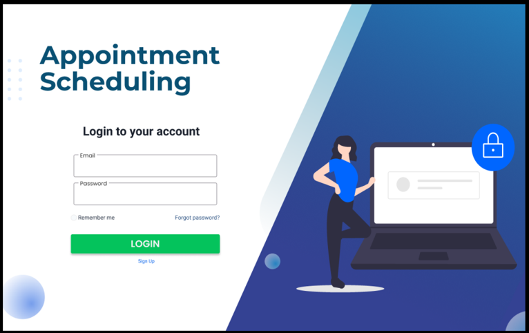
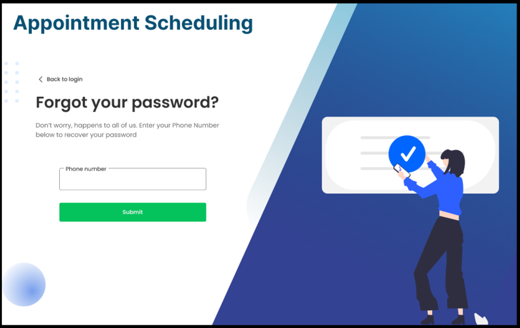
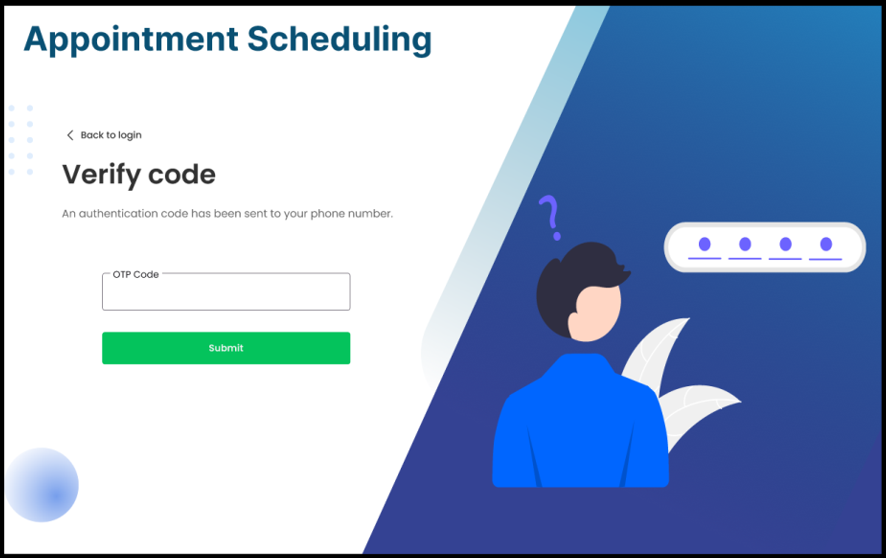
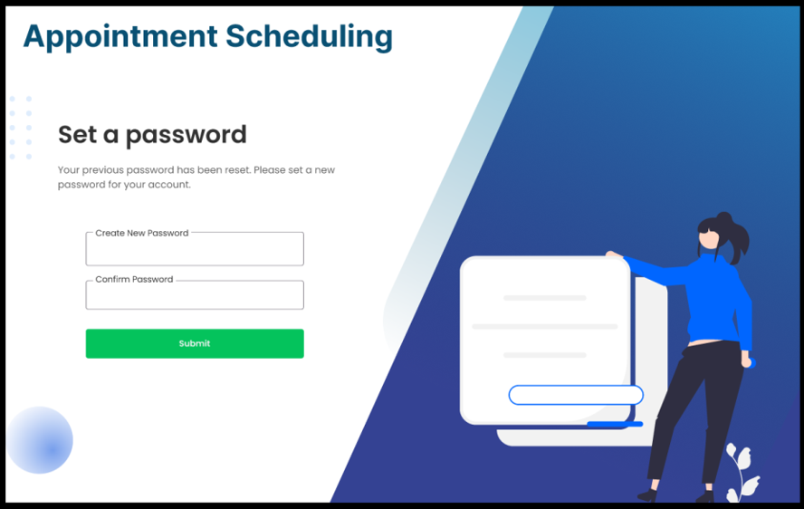
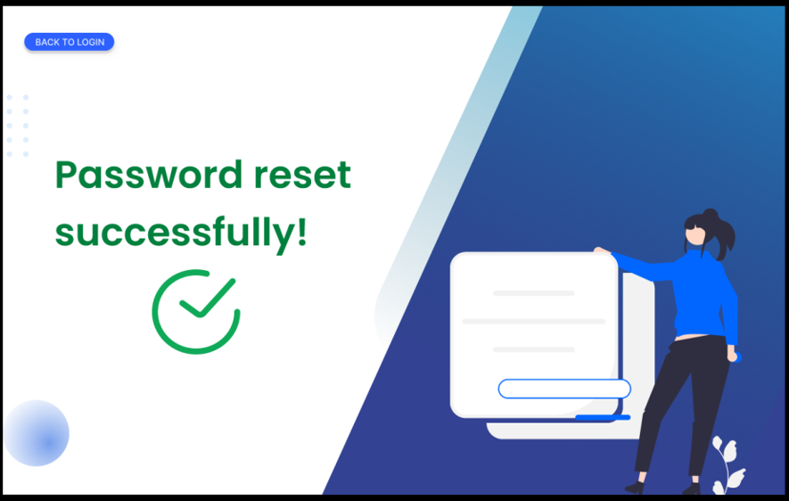

### Appointments and Requestors

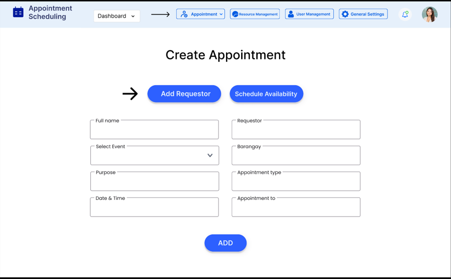
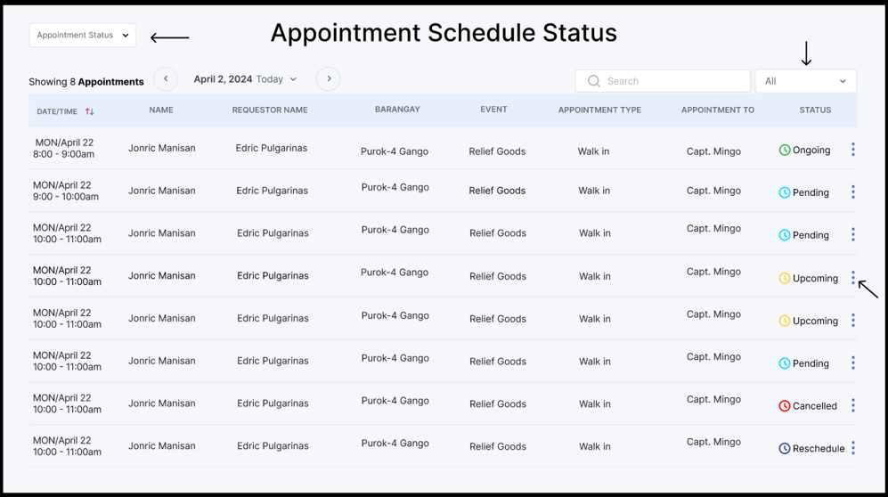
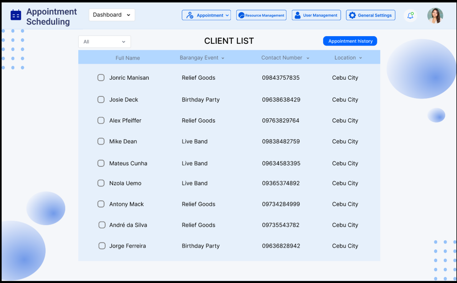
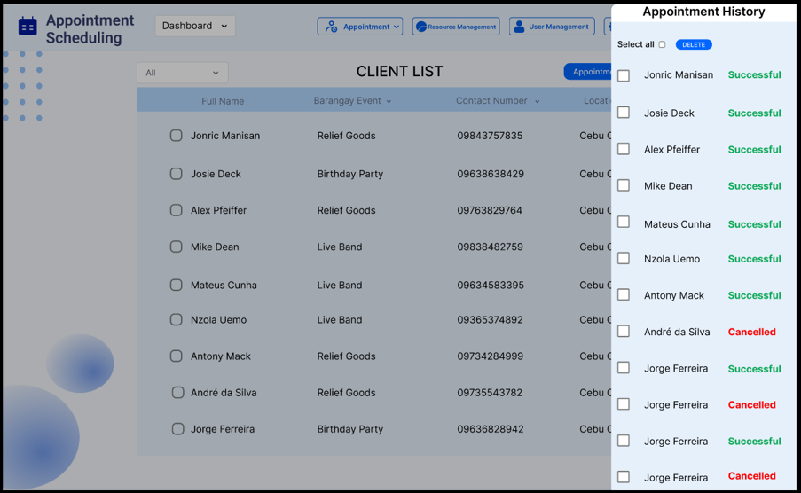
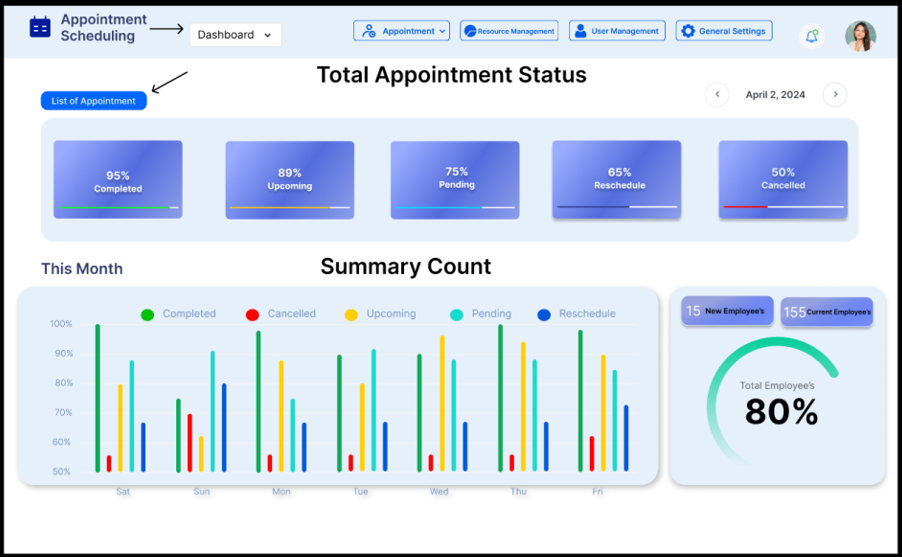
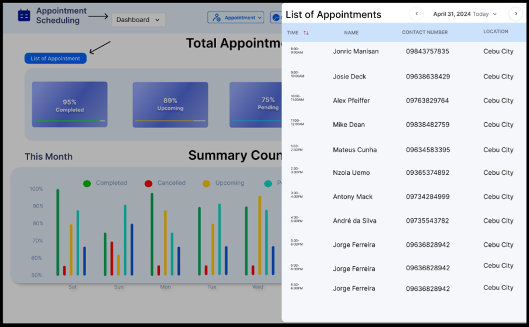

### Employees and Calendar

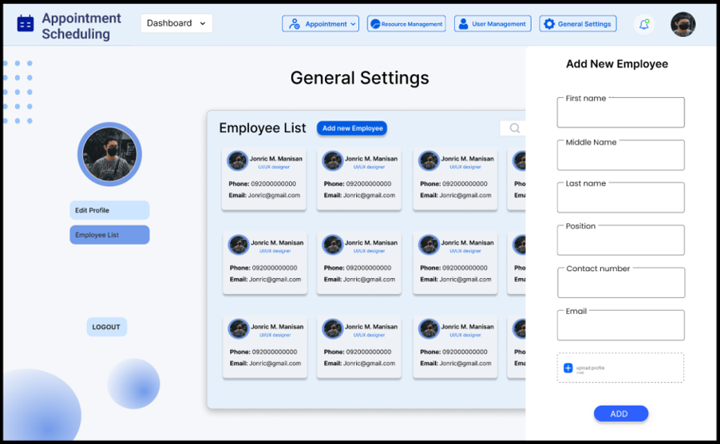
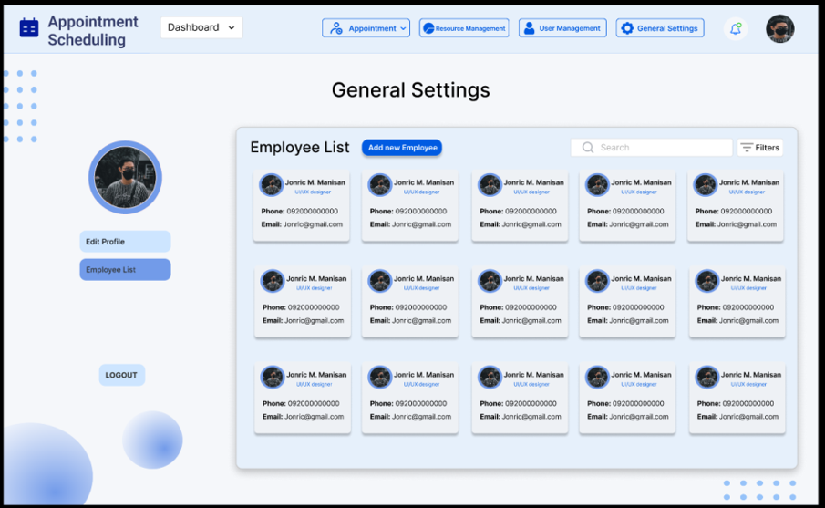
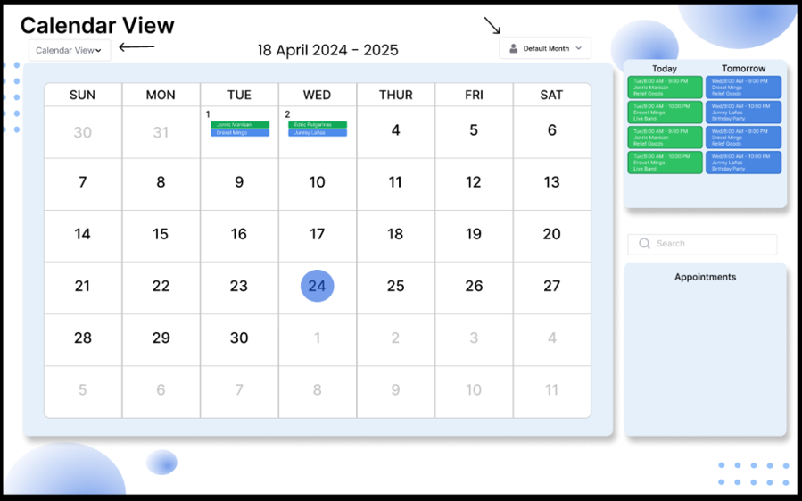
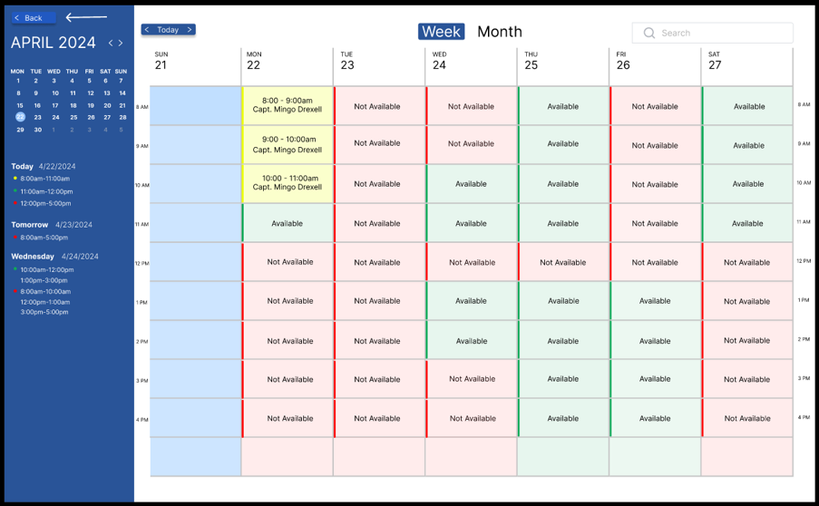

### Settings and User Management

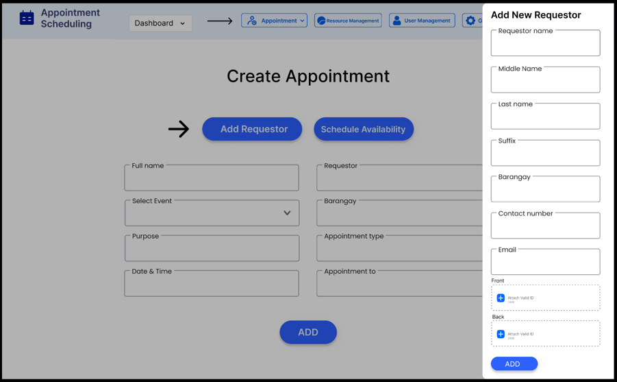
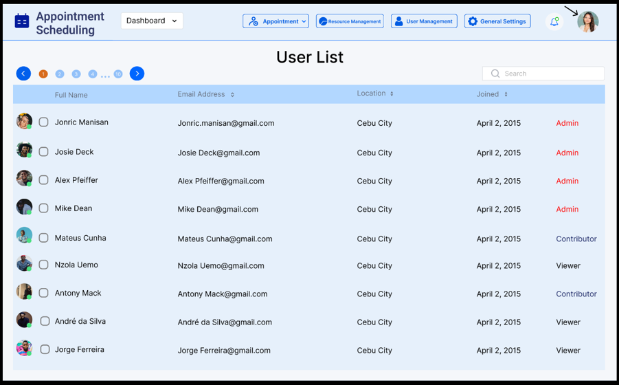
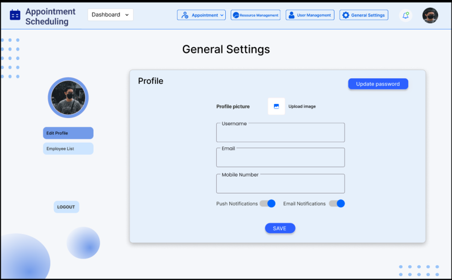
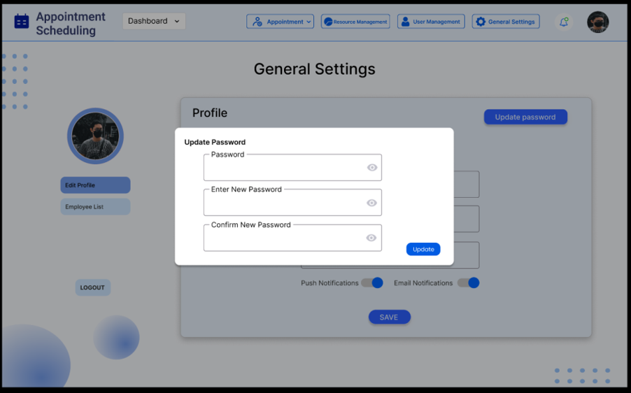
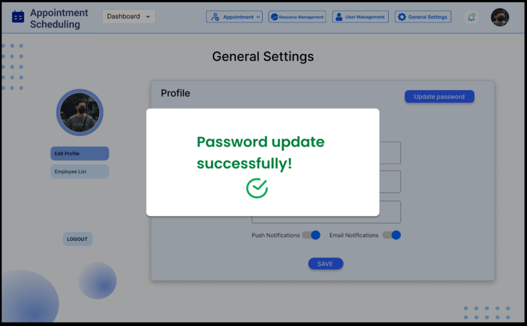
